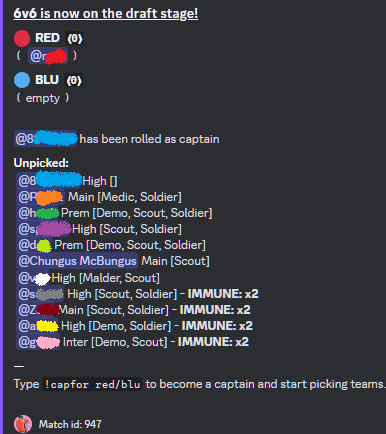

# 🏳️‍🌈 PUBobot2 (Pride Pugs fork)

[**PUBobot2**](https://github.com/Leshaka/PUBobot2) is a Discord bot for pickup games organisation originally made by [Leshaka](https://github.com/Leshaka/PUBobot2)

This is a forked version of the existing bot with some QoL modifications aimed at improving the TF2 Pugging experience - Designed for the Pride Pugs TF2 Community by [Chungus McBungus](https://github.com/chungusmcbungus)

This version of the bot is currently **PRIVATELY HOSTED** due to the costs associated with hosting a public discord bot, but the code is publicly available if you wish to self host (see [🗎 Self-Hosting Guide](#-self-hosting-guide))

I eventually hope to have these changes implemented in a way that is convenient, fully configurable, and does not interfere with the existing flow of PUBobot2 so that the fork can be merged in to the original bot as useful optional features (and so I don't need to pay for hosting)

**<u>Table of Contents</u>**
- [🏳️‍🌈 PUBobot2 (Pride Pugs fork)](#️-pubobot2-pride-pugs-fork)
- [🏳️‍🌈 New Features](#️-new-features)
  - [🆕 Front-Facing Features](#-front-facing-features)
  - [🆕 Back-End Features](#-back-end-features)
  - [🆕 New Queue Variables](#-new-queue-variables)
  - [🆕 New Commands](#-new-commands)
- [🏳️‍🌈 Context](#️-context)
- [🏳️‍🌈 TODO](#️-todo)
- [🏳️‍🌈 More Documentation](#️-more-documentation)
  - [🗎 Original README](#-original-readme)
  - [🗎 Self-Hosting Guide](#-self-hosting-guide)
  - [🗎 Support](#-support)

---

# 🏳️‍🌈 New Features

## 🆕 Front-Facing Features
- Captains can be given Captain **Immunity** for `n` games after Captaining
- Can define a list of Player **Division** and **Class** Roles per Queue
- Player Sorting (Drafting Stage)
  - Initially randomised but with **Immune** Players at the bottom of the list so they do not get rolled Captain
  - After Captains are chosen, Players will then be sorted by **Division** (descending) to aid in the picking process
- Games that end automatically due to `match_lifetime` running out are reported as Draw so they can be tracked in the system
- New Commands (See [🆕 New Commands](#-new-commands) below)
- QoL tweaks
  - Durations formatting (ie:  `!ar` , `!aar`)
    - Assumes minutes if no unit specified (eg: `!ar 10 === !ar 10m`)
    - Assumes max value if no duration specified (eg: `!aar === !aar 15m`)
    - Is now toggled off by specifying "off" (eg: `!ar off` to turn off Auto-Ready)
  - `/auto_ready` now updates to the given time when already active (instead of toggling off)
  - Additions to Printouts
    - Check-In:
      - Time until check-in expires
      - List of Players who have readied up
    - Drafting:
      - Custom Player list formatting. See [🆕 New Queue Variables](#-new-queue-variables)
    - Results (after Match `/report`):
        1. Time taken to pick teams (Start of Drafting -> End of Drafting)
        2. Time taken to play match (End of Drafting -> Match result is Reported)
    - Rank (via the `/rank` command):
      - Now shows number of Captained games and current **Immunity**

## 🆕 Back-End Features
- Bot will now attempt to load from `.env` if no `config.cfg` is found
  - Allows the bot to use System Variables defined on your hosting service (don't put private bot tokens on public github repos)
- DB Table `qc_player_matches` now tracks which Player was `Captain` 
- DB Table `qc_players` now tracks Player `auto_ready_on_add` and `immunity`

## 🆕 New Queue Variables
  - `captain_immunity_games` - Automatically set a Captain's **Immunity** to this after the game
  - `division_roles` - Comma separated list of Division Role names in descending order (eg: `"Prem,High,Inter,Main,Open"`)
  - `class_roles` - Comma separated list of Class Role names (eg: `"Scout,Soldier,Demo,Medic"`)
  - `show_checkin_timer` - Display the time remaining until Check-in expires
  - `player_list_format` - Text format to be used in the Player list at the Drafting stage (eg: `"{mention} {div} [{classes}] {immune}"`) 

    
  - `auto_ready_on_add` - The default setting of `!aar` to give to all Players (they can adjust it themselves)

## 🆕 New Commands
- `/auto_ready_on_add` (aka Auto-Auto-Ready `!aar`)
  - When a Player uses `/add` they will instantly also receive `/auto_ready` - Customisable per Player!
- `/luck <rows:10> <min_games:10>` (**Moderator Only**)
  - Prints a list of the Players with the highest and lowest ratio of Captain to Non-Captain games
- `/set_immunity <player:self> <num:0>` (**Moderator Only**)
  - Manually set the immunity value for a Player
- `/testing add_multiple <player_namews_string:all> <queue:default>` (**Admin Only**)
  - FOR TESTING PURPOSES
  - Forcibly add Players to the queue
- `/testing set_ready_all` (**Admin Only**)
  - FOR TESTING PURPOSES
  - Forcibly ready-up all Players in queue

---

# 🏳️‍🌈 Context

> The TF2 community was previously using PUBobot in the following way

1) All 12 players add and ready up, we enter the Draft stage
2) We use Dyno bot's `/roll` command to determine which players will be forced to play Medic (Get 5 random numbers ranging from 1-12)
   - If the first die rolls `"5"` and you are the 5th player in the list, then you are the Medic (and Captain)
   - After someone plays Medic in a pug, they are **Immune** from playing Medic for 2 games
3) If either of the rolled players had played Medic in the last 2 games, they will type `"Immune"` and post a link to a match log as evidence
4) We then move down the dice roll list to see who will be captain...
5) Once captains are finally decided, they take turns picking players for their teams
6) If a newer player (or someone who doesn't know the other players very well) is captain then they will need to ask others to help them pick the best players

> As you can see this can be a hassle for 3 main reasons

- Manual dice roll (and non-unique results, ie `/roll 12 5` might return `"5 12 5 5 12"`)
- A lot of back-and-forth when players claim to be **Immune**
  - Players have to dig up their match logs
  - Mods have to confirm that the player is not lying
  - Players who were further down the dice roll list sometimes go AFK because they think they aren't captain
  - etc
- It can be very difficult to pick a balanced team unless you know everyone on the server (and sometimes people who offer to "help" you pick can be trolls)

> It was annoying to do and often resulted in 15+ minutes of overhead before a pug even started
>
> This is what prompted me to make my QoL changes

---

# 🏳️‍🌈 TODO
- Option to save games to the database even when they are unranked (current workaround is to use flat ranking system gaining 0.1 per win)
- Map voting AFTER teams have readied up
- Configurable variables for all of the above (to toggle on/off)

---

# 🏳️‍🌈 More Documentation

## 🗎 Original README

> The original README file on Leshaka's github repo
> 
> [Original README](ORIGINAL-README.md)  (Leshaka)

## 🗎 Self-Hosting Guide

> The extra steps I had to do to get it running locally + host it online
> 
> [Self-Hosting Guide](SELF-HOSTING-GUIDE.md)  (Chungus McBungus)

## 🗎 Support

> Please consider supporting developers as this helps us to create useful content and pay for hosting costs
>
> Leshaka [via Boosty](https://boosty.to/leshaka)
>
> Chungus McBungus [tbd](https://github.com/chungusmcbungus/PUBobot2)

